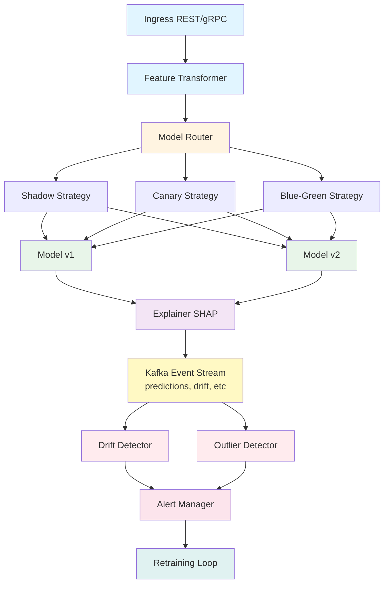

# Risk/Churn Scoring Platform

[](https://www.python.org/downloads/)
[](LICENSE)
[](https://github.com/psf/black)
[](tests/)
[](tests/)
[](Dockerfile)
[](k8s/)

A production-ready ML platform for risk and churn prediction with A/B testing, drift detection, and automated retraining, built on Seldon Core.

## Features

### Interactive Web Dashboard
- **Real-time Monitoring**: Live metrics, health status, and system performance
- **Drift Detection UI**: Visual feature drift analysis with p-value tracking
- **Prediction Testing**: Interactive interface to test churn predictions
- **Model Management**: Deploy, promote, and rollback models with one click
- **Analytics Dashboard**: Customer segments, feature importance, and insights
- **Responsive Design**: Works on desktop, tablet, and mobile

### Core Capabilities
- **Multi-Model Deployment**: Support for multiple model versions (v1, v2) with intelligent routing
- **REST & gRPC APIs**: V2 protocol support for high-performance inference
- **Feature Transformation Pipeline**: Automated preprocessing and feature engineering
- **Model Explainability**: SHAP and Alibi-based explanations for predictions

### Deployment Strategies
- **Shadow Deployment**: Run v2 alongside v1 without affecting production traffic
- **Canary Releases**: Gradually roll out new models with configurable traffic splitting
- **Blue-Green Deployment**: Instant switchover between model versions
- **Automated Rollback**: Quick reversion to previous version if issues detected

### Monitoring & Quality Assurance
- **Drift Detection**: Statistical drift detection using Alibi Detect (KS, MMD, Tabular)
- **Outlier Detection**: Isolation Forest and Mahalanobis distance-based outlier detection
- **Prometheus Metrics**: Comprehensive metrics for latency, throughput, and model performance
- **Grafana Dashboards**: Pre-built dashboards for visualization
- **Alerting System**: Configurable alerts for drift, outliers, and performance degradation

### Async Processing & Retraining
- **Kafka Integration**: Async mirroring of requests for offline evaluation
- **Feedback Loop**: Collect ground truth labels for continuous learning
- **Automated Retraining**: Scheduled or trigger-based model retraining
- **Performance Validation**: Automatic quality gates before deployment

## Architecture



## Quick Start

**For detailed guides, see the [docs](docs/) folder:**
- [Quick Start Guide](docs/QUICK_START.md) - Get running in 5 minutes
- [Deployment Guide](docs/DEPLOYMENT.md) - Complete deployment instructions
- [Dashboard Guide](docs/DASHBOARD_GUIDE.md) - Web UI user manual
- [Blog Post](docs/BLOG_POST.md) - Project story and technical deep dive

### Prerequisites
- Python 3.11+
- Docker & Docker Compose
- Kubernetes cluster (for production)
- uv (Python package installer)

### Local Development

1. **Clone and setup**:
```bash
git clone <repository-url>
cd risk-churn-platform
```

2. **Install dependencies**:
```bash
# Create virtual environment
uv venv
source .venv/bin/activate  # or `.venv\Scripts\activate` on Windows

# Install dependencies
uv pip install -e ".[dev]"
```

3. **Install pre-commit hooks**:
```bash
pre-commit install
```

4. **Start full platform with Docker Compose**:
```bash
docker-compose up -d
```

This starts:
- **Frontend Dashboard** (http://localhost)
- **Backend API** (http://localhost:8000)
- Kafka & Zookeeper
- Redis
- Prometheus & Grafana
- API service

5. **Run tests**:
```bash
pytest tests/ -v --cov=src
```

### Making Predictions

```bash
curl -X POST http://localhost:8080/predict \
  -H "Content-Type: application/json" \
  -d '{
    "customer_tenure": 24,
    "monthly_charges": 79.99,
    "total_charges": 1919.76,
    "contract_type": "Two year",
    "payment_method": "Credit card",
    "internet_service": "Fiber optic",
    "support_tickets": 2,
    "login_frequency": 5.2
  }'
```

### Get Explanation

```bash
curl -X POST http://localhost:8080/explain \
  -H "Content-Type: application/json" \
  -d '{
    "customer_tenure": 24,
    "monthly_charges": 79.99,
    "total_charges": 1919.76,
    "contract_type": "Two year",
    "payment_method": "Credit card",
    "internet_service": "Fiber optic",
    "support_tickets": 2,
    "login_frequency": 5.2
  }'
```

## Deployment

### Kubernetes with Seldon Core

1. **Install Seldon Core**:
```bash
kubectl create namespace seldon-system
kubectl apply -f https://github.com/SeldonIO/seldon-core/releases/download/v1.18.0/seldon-core.yaml
```

2. **Create namespace and deploy infrastructure**:
```bash
kubectl apply -f k8s/namespace.yaml
kubectl apply -f k8s/kafka-deployment.yaml
kubectl apply -f k8s/monitoring-deployment.yaml
```

3. **Deploy model with shadow mode** (for initial testing):
```bash
kubectl apply -f k8s/seldon-deployment-shadow.yaml
```

4. **After validation, switch to canary**:
```bash
kubectl apply -f k8s/seldon-deployment-canary.yaml
```

5. **Deploy monitoring services**:
```bash
kubectl apply -f k8s/drift-detector-deployment.yaml
```

### Release Strategy

#### Phase 1: Shadow Deployment (Week 1-2)
- Deploy v2 in shadow mode
- v1 serves all production traffic
- v2 runs in parallel, predictions logged but not returned
- Monitor prediction differences and performance

```bash
# Check shadow analysis
curl http://localhost:8080/router/shadow-analysis
```

#### Phase 2: Canary Release (Week 3-4)
- Start with 10% traffic to v2
- Monitor metrics, error rates, latency
- Gradually increase to 25%, 50%, 75%

```bash
# Current metrics
curl http://localhost:8080/router/metrics
```

#### Phase 3: Full Rollout
- If all metrics are good, promote v2 to 100%

```bash
curl -X POST http://localhost:8080/router/promote-v2
```

#### Emergency Rollback
```bash
curl -X POST http://localhost:8080/router/rollback
```

## Configuration

Configuration is managed in [config/config.yaml](config/config.yaml). Key settings:

```yaml
router:
  strategy: "shadow"  # shadow, canary, blue-green
  canary_weight: 0.1  # 10% traffic to v2

monitoring:
  drift_detection:
    enabled: true
    threshold: 0.05

  outlier_detection:
    enabled: true
    contamination: 0.1

retraining:
  enabled: true
  schedule: "0 2 * * 0"  # Weekly at 2 AM
  min_samples: 10000
  performance_threshold: 0.85
```

## Monitoring

### Prometheus Metrics
- `predictions_total`: Total predictions by model version and status
- `prediction_latency_seconds`: Prediction latency histogram
- `drift_detected_total`: Drift detection events
- `outliers_detected_total`: Outlier detection events

### Grafana Dashboards

Access Grafana at `http://localhost:3000` (default credentials: admin/admin)

Pre-built dashboards include:
- Model Performance Overview
- Drift Detection Metrics
- Traffic Distribution (Canary)
- Shadow Deployment Analysis

### Kafka Topics

- `ml.predictions`: All prediction events
- `ml.drift-alerts`: Drift detection alerts
- `ml.outliers`: Outlier detection events
- `ml.feedback`: Ground truth labels for retraining

## Testing

```bash
# Run all tests
pytest

# Run with coverage
pytest --cov=src --cov-report=html

# Run specific test file
pytest tests/unit/test_models.py -v

# Run integration tests
pytest tests/integration/ -v
```

## Retraining

The platform supports automated retraining:

1. **Feedback Collection**: Ground truth labels collected via Kafka
2. **Performance Monitoring**: Track model degradation over time
3. **Automated Trigger**: Retraining triggered when:
   - Sufficient feedback samples collected (min_samples)
   - Performance drops below threshold
   - Manual trigger via API

4. **Quality Gates**: New models deployed only if they meet performance threshold

## API Documentation

Once running, visit:
- Swagger UI: `http://localhost:8080/docs`
- ReDoc: `http://localhost:8080/redoc`

## Contributing

1. Fork the repository
2. Create a feature branch
3. Make your changes
4. Run tests and pre-commit hooks
5. Submit a pull request

## License

[Your License Here]

## Support

For issues and questions:
- GitHub Issues: [link]
- Documentation: [link]
- Slack: [link]
